<td style="width: 20%;"></td>

# Introdução

O Tasmota é um firmware de código aberto para dispositivos baseados nos chipsets Espressif ESP8266, ESP32, ESP32-S ou ESP32-C3, criado e mantido por Theo Arends. Ele começou como uma maneira simples de hackear um Sonoff Basic (um dos primeiros dispositivos de casa inteligente baratos e acessíveis no mercado) vinculado à nuvem, transformando-o em um dispositivo controlado localmente. Desde então, evoluiu para um ecossistema completo para praticamente qualquer dispositivo baseado em ESP.

Este tutorial busca ensinar de forma simples e direta comoe instalar e configurar o Tasmota, assim como mostrar os passos para a integração com o Home Assistant, permitindo que você use livremente seus dispositivos ESP para personalizar suas automações residenciais. Utilizaremos um ESP32 neste tutorial, mas as etapas fornecidas também devem funcionar para configurar o Tasmota em dispositivos ESP82XX.

# Instruções de Instalação

Os passos apresentados a seguir foram retirados do site oficial do Tasmota: [Tasmota - Getting Started](https://tasmota.github.io/docs/Getting-Started/).

## Software Necessário

### Firmware Binário do Tasmota

Neste tutorial, instalaremos a versão básica do Tasmota para ESP32 usando o Instalador Web, então você não precisará baixar nenhum arquivo ou software para segui-lo. No entanto, caso escolha outro método de instalação, você pode precisar baixar um arquivo binário de firmware do Tasmota (.bin). Se você não tem certeza de qual binário é o certo para você, comece com o **tasmota.bin** ou consulte a [tabela de compilações](https://tasmota.github.io/docs/Firmware-Builds/) para ver quais recursos você precisa. Os binários poder ser obtidos no servidor OTA oficial do Tasmota ([ESP8266](http://ota.tasmota.com/tasmota/release/) e [ESP32](http://ota.tasmota.com/tasmota32/release/)).

### Ferramenta de Flash

O Tasmota oferece 4 ferramentas para a instalação. Usaremos o **Tasmota Web Installer**, pois ele é compatível com ESP82XX e ESP32 e não requer nenhum download ou instalação de software.

- [Tasmota Web Installer](https://tasmota.github.io/install/) - instale o Tasmota usando um navegador baseado no Chrome para ESP82XX e ESP32
- [Tasmotizer](https://github.com/tasmota/tasmotizer) - ferramenta de flash e download de firmware apenas para ESP82XX. (Windows, Linux ou Mac)
- [ESP-Flasher](https://github.com/Jason2866/ESP_Flasher) - ferramenta gráfica para flash baseada no esptool.py para ESP82XX e ESP32. (Windows, Linux ou Mac)
- [Esptool.py](https://github.com/espressif/esptool) - a ferramenta de flash oficial da Espressif para ESP82XX e ESP32. (Requer Python)

## Tasmota Web Installer

Com o Instalador Web do Tasmota, você pode fazer o flash do Tasmota diretamente do seu navegador da web. Você só precisa conectar o dispositivo ESP ao seu computador usando USB ou um adaptador serial para USB (certifique-se que o cabo utilizado suporta transporte de dados!), selecionar a variante de firmware adequada para o seu dispositivo e clicar no botão **CONNECT**. Ele solicitará a porta correta onde o dispositivo está localizado e iniciará o processo de instalação.

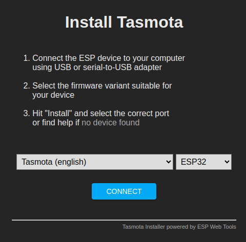

Clique em install Tasmota.

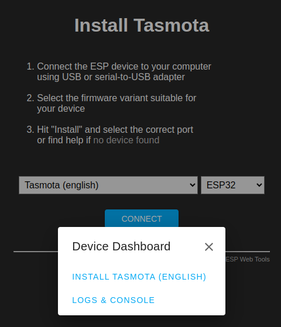

Clique em NEXT.

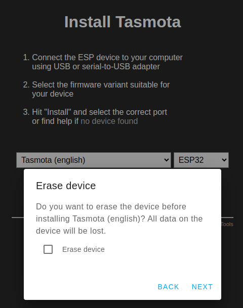

Prossiga com a instalação.

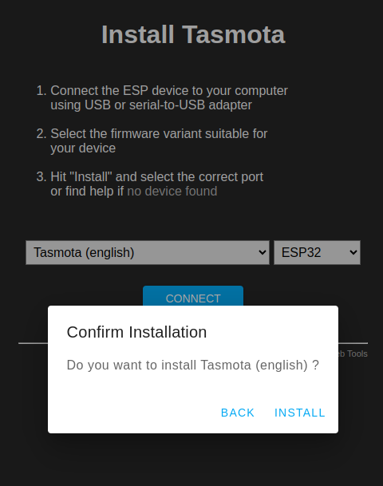

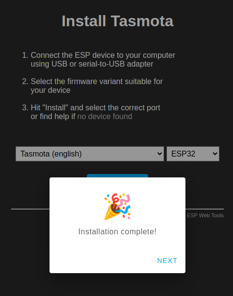

Configure o ponto de acesso WIFI.

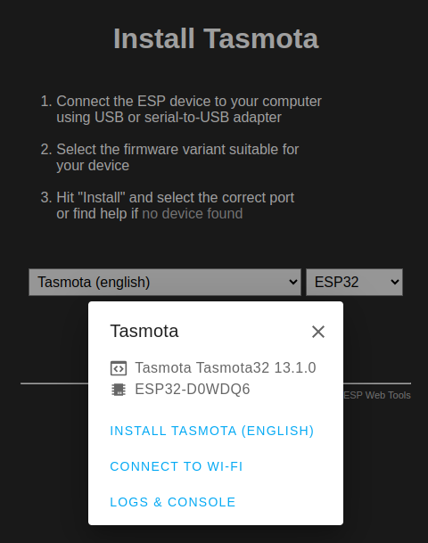

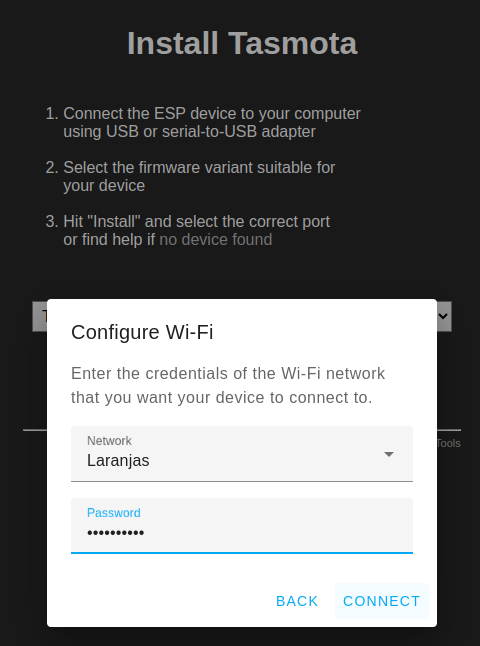

Clique em Visit Device para abrir uma nova guia com a interface Web do ESP configurado.

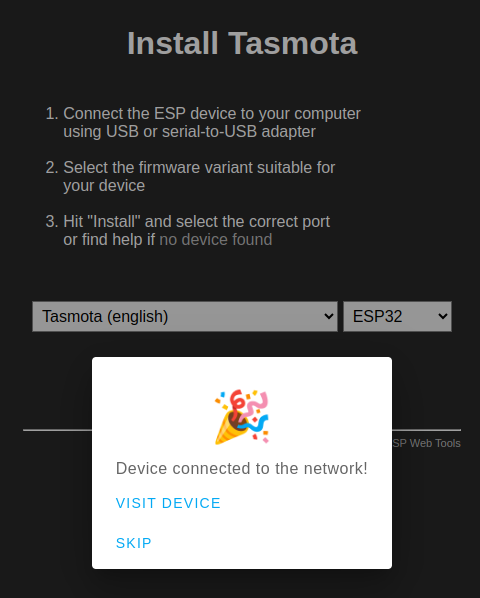

# Interface Web

A interface de usuário web do Tasmota é uma maneira prática de controlar e gerenciar o seu dispositivo com Tasmota. Para acessá-la, use o endereço IP do seu dispositivo no seu navegador web favorito. Por padrão, a interface começa no modo administrador não protegido, que permite acesso completo ao seu dispositivo para qualquer pessoa com acesso a esse IP.

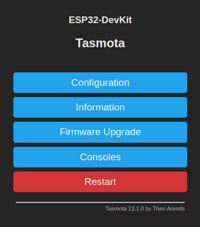

A interface possui 4 opções de menu:

- **Configuração**: O menu de configuração permite que você configure tudo, desde componentes até Wi-Fi, e oferece a opção de fazer backup e restaurar a configuração em um local seguro.
- **Informações**: Exibe uma única página carregada com informações sobre o dispositivo, incluindo: versão atual do Tasmota, dados do ponto de acesso Wi-Fi, dados do host MQTT e muito mais.
- **Atualização de Firmware**: Um menu fácil de usar para iniciar uma atualização de firmware a partir de um arquivo .bin carregado ou de um servidor OTA.
- **Console**: Acesso ao terminal do Tasmota. Emita comandos ou siga o fluxo de informações.

## Configuração

### Configure Module

Esta janela serve para alterar a configuração do dispositivo ESP, customizando=a como desejado; Para proporcionar o acionamento de um relé, configuramos o GPIO associado para funcionar como relé, como mostrado abaixo.

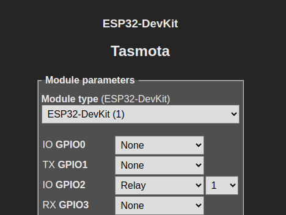

O ESP32 possui um sensor de efeito Hall embutido que detecta mudanças no campo magnético ao seu redor. Ele está localizado atrás da tampa de metal do módulo e conectado aos pinos GPIO36 e GPIO39. Para habilita-lo, faça a seguinte alteração na configuração do módulo:

- GPIO36 como HallEffect 1
- GPIO39 como HallEffect 2

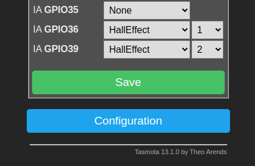

Este relé e sensor serão utilizados para demonstração no restante do tutorial. Clique em salvar e espere o dispositivo reiniciar.

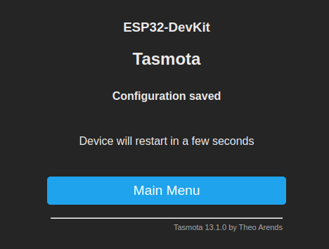

Uma vez reiniciado, podemos ver as alterações feitas na tela inicial, que agora mostra o valor do sensor de efeito hall e um botão para acionamento do relé.

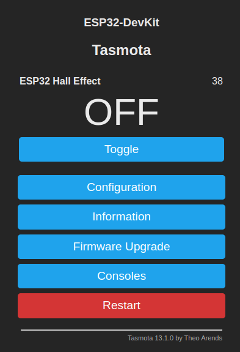

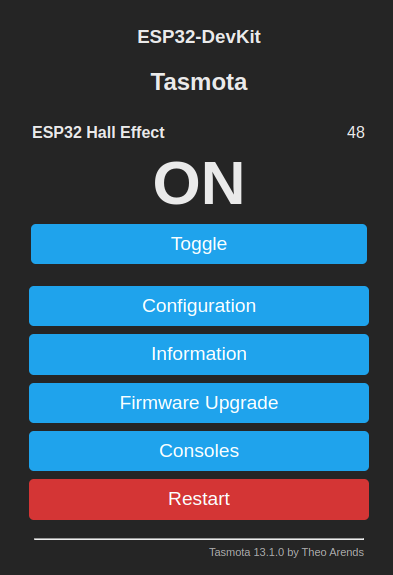

### Configure MQTT

Conecte o Tasmota ao broker MQTT de sua escolha. Aqui, foi utilizado o Mosquitto, rodando como add-on no Home Assistant.

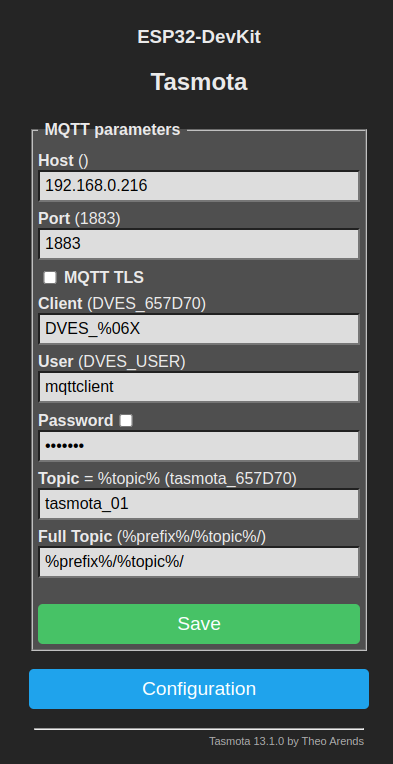

Assim que conectado, são criados topicos associados ao dispositivo. Na imagem abaixo, o software [MQTT Explorer](http://mqtt-explorer.com/) foi utilizado para visualização dos topicos e valores no broker MQTT.

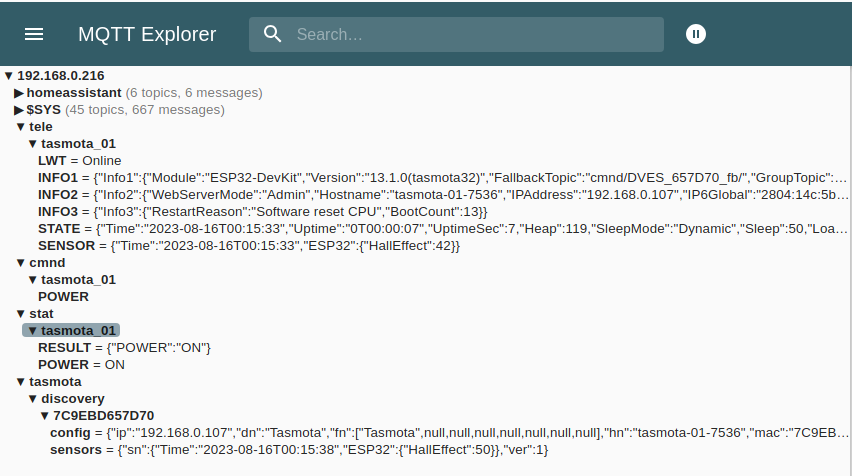

## Consoles

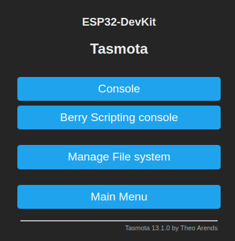

### Console

Abaixo podemos ver o console do Tasmota. Quando enviamos o comando **power off**, o relé é desativado e o estado atualizado no respectivo topico MQTT.

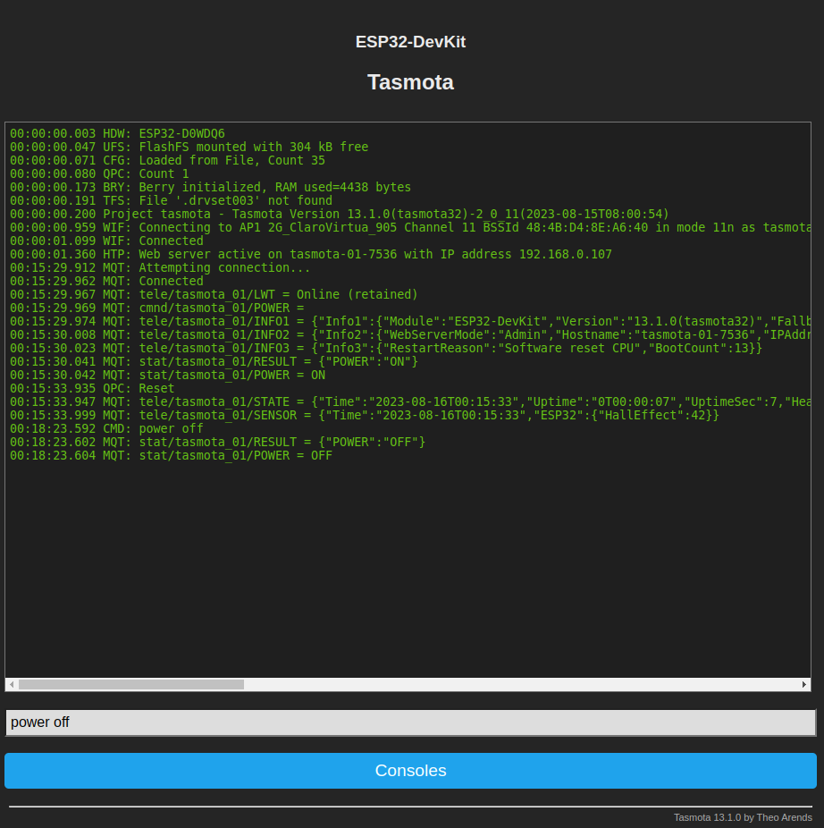

Similarmente, se publicamos **on** no topico **cmnd/tasmota_01/POWER**, o relé é acionado.

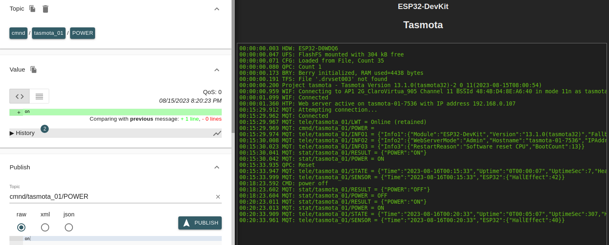

# Integração com o Home Assistant

Para integrar o Tasmota com o Home assistant, siga os passos mostrados abaixo. Caso prefira acompanhar um video, o video [Home Assistant Tasmota Integration (HOW-TO)](https://www.youtube.com/watch?v=ownHLQbAZ8Y) possui um passo a passo de como realizar a integração.

Para configurar a descoberta nativa do Tasmota no Home Assistant, abra o console e envie o comando **SetOption19 0**

Além disso, o comando **SetOption30 0** configura o icone como sendo um **switch**. Caso queira um icone de **light**, use **SetOption30 1**.

Feito isso, o Home Assitant ja deve ter descoberto a nova integração automaticamente. Caso isso não ocorreu, adicione-a clicando em **+ ADICIONAR INTEGRAÇÃO**. Em seguida, clique em configurar. Caso os passos anteriores tenham sido efetuados corretamente, o tasmota sera descoberto automaticamente a adicionado como um novo dispositivo.

Clicar no dispositivo abre a janela de informações dele, onde podemos ver todas as entidades cadastradas. Podemos observar que o **switch** de controle do relé e o **sensor** de efeito hall foram automaticamente adicionados e ja podem ser utilizados normalmente no Dashboard.

Finalmente, podemos ver que, além do **switch** e do **sensor**, diversas outras entidades são adicionadas automaticamente. Contudo, nem todas são habilitadas por padrão.

Para abilitar uma entidade desabilitada, abra a janela de informações do dispositivo e clique na entidade que deseja habilitar.

Em seguida, mude o estado do campo **Habilitado**.

A entidade passara a estar disponivel para ser utilizada.

# Sites relacionados ao Home Assistant - Tasmota

- Site oficial do Tasmota: https://tasmota.github.io/docs/
- Documentação oficial da integração do Tasmota com Home assistant: https://www.home-assistant.io/integrations/tasmota/
- Site do MQTT Explorer: http://mqtt-explorer.com/

# Status do Projeto

