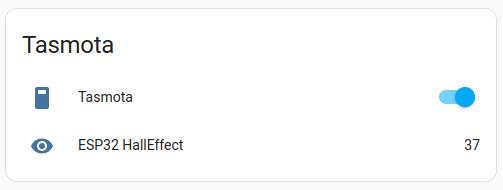

<td style="width: 20%;"></td>

# Integração do Home Assistant com o Tasmota via MQTT

A integração do **Home Assistant** com dispositivos que utilizam o firmware **Tasmota** é uma solução eficiente e flexível para automação residencial. Essa integração é feita através do protocolo **MQTT** (Message Queuing Telemetry Transport), que permite a comunicação entre o Home Assistant e os dispositivos Tasmota de forma rápida e confiável.

Para integrar o Tasmota com o Home assistant, siga os passos mostrados abaixo. Caso prefira acompanhar um video, o video [Home Assistant Tasmota Integration (HOW-TO)](https://www.youtube.com/watch?v=ownHLQbAZ8Y) possui um passo a passo de como realizar a integração.

---

## Requisitos

1. **Home Assistant** configurado e em funcionamento.
2. Dispositivo com **Tasmota** instalado.
3. Um broker MQTT configurado e acessível (por exemplo, Mosquitto).
4. Acesso à interface web do dispositivo Tasmota.

---

## Configurando o Broker MQTT

1. **Instalar o broker MQTT**:
   - No Home Assistant, vá para `Configurações > Add-ons > Loja de Add-ons`.
   - Instale o add-on **Mosquitto broker**.
   - Configure o broker com as credenciais desejadas.
   - Não esqueça de criar o usuário de mqtt no home assistant

2. **Habilitar o MQTT no Home Assistant**:
   - No arquivo `configuration.yaml`, adicione:
     ```yaml
     mqtt:
       broker: "SEU_IP_DO_BROKER"
       username: "SEU_USUARIO"
       password: "SUA_SENHA"
     ```

3. Reinicie o Home Assistant para aplicar as alterações.

---

## Configurando o Dispositivo Tasmota

1. Acesse a interface web do dispositivo Tasmota.
2. Navegue para **Configuration > Configure MQTT**.
3. Insira as informações do broker MQTT:
   - **Host**: IP do broker (geralmente o mesmo do Home Assistant).
   - **Port**: 1883 (porta padrão MQTT).
   - **User**: Usuário configurado no broker.
   - **Password**: Senha configurada no broker.
   - **Client**: Identificador único para o dispositivo.
   - **Topic**: Nome do tópico MQTT (ex.: `tasmota_lampada`).

4. Salve as configurações e reinicie o dispositivo.

---

## Descoberta Automática no Home Assistant

Se o **dispositivo Tasmota** estiver configurado com **SetOption19 1**, ele utilizará a descoberta automática do Home Assistant:

1. No console do Tasmota, digite:
   ```
   SetOption19 1
   ```
2. O Home Assistant detectará automaticamente o dispositivo e o adicionará à interface.

---

## Adicionando Manualmente ao Home Assistant

Caso prefira adicionar manualmente:

1. No `configuration.yaml`, adicione:
   ```yaml
   switch:
     - platform: mqtt
       name: "Lâmpada Sala"
       command_topic: "cmnd/tasmota_lampada/POWER"
       state_topic: "stat/tasmota_lampada/POWER"
       payload_on: "ON"
       payload_off: "OFF"
       qos: 1
       retain: true
   ```
2. Salve o arquivo e reinicie o Home Assistant.

---

## Verificando a Integração

1. Após a configuração, vá para `Configurações > Dispositivos e Serviços` no Home Assistant.
2. Verifique se o dispositivo Tasmota aparece listado.
3. Teste o controle (ligar/desligar, por exemplo) para confirmar a comunicação.

---

## Dicas Adicionais

- Use a ferramenta de **debug do MQTT** no Home Assistant para monitorar os tópicos e mensagens trocadas.
- Certifique-se de que o Tasmota esteja configurado para usar uma versão de MQTT compatível com o broker.
- Utilize nomes de tópicos únicos para evitar conflitos com outros dispositivos.

Com isso, o Home Assistant estará totalmente integrado ao dispositivo Tasmota via MQTT, permitindo automações, controle remoto e monitoramento diretamente pela interface.

---

 ## Para configurar a descoberta nativa do Tasmota no Home Assistant, abra o console e envie o comando **SetOption19 0**


Além disso, o comando **SetOption30 0** configura o icone como sendo um **switch**. Caso queira um icone de **light**, use **SetOption30 1**.


Feito isso, o Home Assitant ja deve ter descoberto a nova integração automaticamente. Caso isso não ocorreu, adicione-a clicando em **+ ADICIONAR INTEGRAÇÃO**. Em seguida, clique em configurar. Caso os passos anteriores tenham sido efetuados corretamente, o tasmota sera descoberto automaticamente a adicionado como um novo dispositivo.


Clicar no dispositivo abre a janela de informações dele, onde podemos ver todas as entidades cadastradas. Podemos observar que o **switch** de controle do relé e o **sensor** de efeito hall foram automaticamente adicionados e ja podem ser utilizados normalmente no Dashboard.




Finalmente, podemos ver que, além do **switch** e do **sensor**, diversas outras entidades são adicionadas automaticamente. Contudo, nem todas são habilitadas por padrão.


Para abilitar uma entidade desabilitada, abra a janela de informações do dispositivo e clique na entidade que deseja habilitar.


Em seguida, mude o estado do campo **Habilitado**.


A entidade passara a estar disponivel para ser utilizada.


# Sites relacionados ao Home Assistant - Tasmota

- Site oficial do Tasmota: https://tasmota.github.io/docs/
- Documentação oficial da integração do Tasmota com Home assistant: https://www.home-assistant.io/integrations/tasmota/
- Site do MQTT Explorer: http://mqtt-explorer.com/

# Status do Projeto


